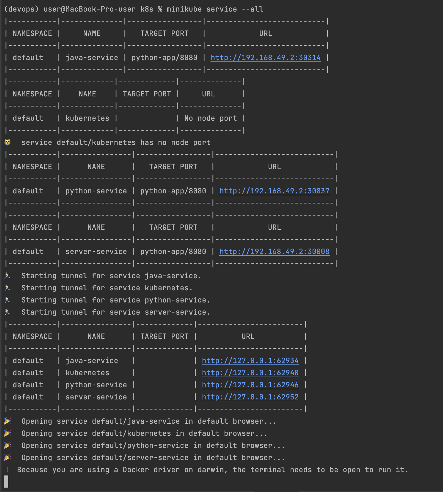

# K8s
### Output for pods

### Output for services

### IP proof

# Bonus task

### Ingress
Some kind of API, that takes applications from outside the scope
of a cluster and manages its access to the working cluster  
Furthermore it provides security via SSL and can do load-balancing

### Ingress controller
As I understood it is the typical controller as a pattern, but used to suppot Ingress
itself which is described in the above section  
There are various Ingress controllers that can be used to run
Ingress, such as nginx, AWS and others

### StatefulSet
It is an API similar to the **deployment**, but used to work with
**stateful** applications inside the cluster  
However in this scenario pods their persistent identifier therefore
they are not interchangeable as it was using **deployment**  
This approach also can be used if we want to use storage volumes

### DaemonSet
As it comes from its name this set has a similar attitude
towards typical set as a daemon threads to the usual ones  
Daemon set allows to run copy of pods, so they will be removed 
from the cluster with the original ones.  
It can be used in order to provide nods monitoring, logging
or running cluster storage daemon

### PersistentVolumes
This is a storage manager as it comes from its name.  
PersistentVolumes provides API for the cluster administration
in a convenient abstract way, so that they don't have to
differentiate the way of how storage is managed from its consumption.  
There is no clear difference in terms of its architecture from 
usual pods, but PersistentVolumes captures storage implementation
details and has an independent lifecycle from other pods.